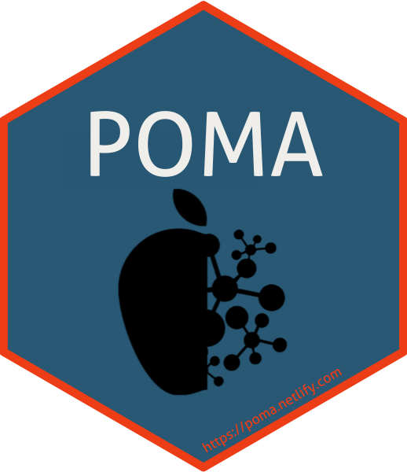

# POMA 

  <!-- badges: start -->
  
  [](https://www.tidyverse.org/lifecycle/#stable)
  [](https://github.com/pcastellanoescuder/POMA/actions/workflows/R-CMD-check.yaml)
  [](https://codecov.io/gh/pcastellanoescuder/POMA?branch=master)
  [](https://www.codefactor.io/repository/github/pcastellanoescuder/POMA)
  [](https://github.com/pcastellanoescuder/POMA/commits/master)
  [](https://www.gnu.org/licenses/gpl-3.0)

| _BioC_ branch 	| Status 	| Version 	| Dependencies 	| Rank 	|
|-	|-	|-	|-	|-	|
| [Release](http://bioconductor.org/packages/release/bioc/html/POMA.html) 	| [](https://bioconductor.org/checkResults/release/bioc-LATEST/POMA/) 	| [](https://www.bioconductor.org/packages/POMA) 	| [](http://bioconductor.org/packages/release/bioc/html/POMA.html#since) 	| [](https://bioconductor.org/packages/stats/bioc/POMA) 	|
| [Devel](http://bioconductor.org/packages/devel/bioc/html/POMA.html) 	| [](https://bioconductor.org/checkResults/devel/bioc-LATEST/POMA/) 	| [](https://bioconductor.org/packages/devel/bioc/html/POMA.html) 	| [](http://bioconductor.org/packages/devel/bioc/html/POMA.html#since) 	| [](https://bioconductor.org/packages/stats/bioc/POMA) 	|

  <!-- badges: end -->

The `POMA` package offers a comprehensive toolkit designed for omics data analysis, streamlining the process from initial visualization to final statistical analysis. Its primary goal is to simplify and unify the various steps involved in omics data processing, making it more accessible and manageable within a single, intuitive R package. Emphasizing on reproducibility and user-friendliness, `POMA` leverages the standardized `SummarizedExperiment` class from Bioconductor, ensuring seamless integration and compatibility with a wide array of Bioconductor tools. This approach guarantees maximum flexibility and replicability, making `POMA` an essential asset for researchers handling omics datasets.   

<!-- POMA provides two different Shiny apps both for exploratory data analysis and statistical analysis that implement all POMA functions in two user-friendly web interfaces.      -->

<!--   - **POMAShiny**: Shiny version of this package. https://github.com/pcastellanoescuder/POMAShiny   -->
<!--   - **POMAcounts**: Shiny version for exploratory and statistical analysis of mass spectrometry spectral counts data and RNAseq data. https://github.com/pcastellanoescuder/POMAcounts    -->

## Installation

To install the Bioconductor last release version:

```{r, eval = FALSE}
# install.packages("BiocManager")
BiocManager::install("POMA")
```

To install the GitHub version:

```{r, eval = FALSE}
# install.packages("devtools")
devtools::install_github("pcastellanoescuder/POMA")
```

## Citation

Castellano-Escuder et al. POMAShiny: A user-friendly web-based workflow for metabolomics and proteomics data analysis. _PLoS Comput Biol._ 2021 Jul 1;17(7):e1009148. doi: 10.1371/journal.pcbi.1009148. PMID: 34197462; PMCID: PMC8279420.

```{bibtex}
@article{castellano2021pomashiny,
  title={POMAShiny: A user-friendly web-based workflow for metabolomics and proteomics data analysis},
  author={Castellano-Escuder, Pol and Gonz{\'a}lez-Dom{\'\i}nguez, Ra{\'u}l and Carmona-Pontaque, Francesc and Andr{\'e}s-Lacueva, Cristina and S{\'a}nchez-Pla, Alex},
  journal={PLOS Computational Biology},
  volume={17},
  number={7},
  pages={e1009148},
  year={2021},
  publisher={Public Library of Science San Francisco, CA USA}
}
```

## News

Click [here](https://github.com/pcastellanoescuder/POMA/blob/master/NEWS.md) for the latest package updates.      

